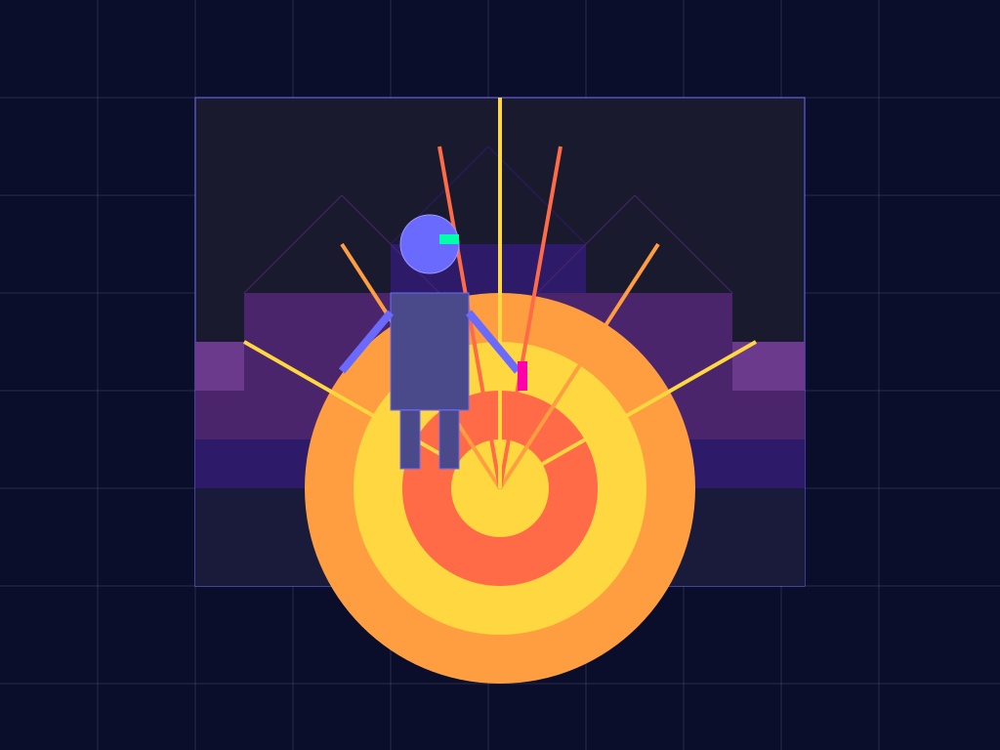

# agentic-art — A Production-Grade Multi-Agent AI Architecture

<p align="center">
  
  <br> <i>"A friendly futuristic AI robot artist creating a colorful geometric sunset-over-mountains painting from circles, rectangles, and lines on a digital canvas"</i>.
  <em></em>
</p>

A multi-agent painting system where LLM agents collaborate to turn a natural-language request into a structured painting and a rendered image.

The project uses **LangChain**, **LangGraph**, **MCP**, **Ollama**, **Mistral**, **Pydantic**, **SVG/CairoSVG**, and **OpenTelemetry** to provide a modular foundation for experimenting with collaborative AI agents that can perform real drawing operations.

---

# Table of Contents

- [Project Idea](#project-idea)
- [Goals](#goals)
- [Architecture](#architecture)
- [Technology Stack](#technology-stack)
- [How It Works](#how-it-works)
- [Project Structure](#project-structure)
- [Core Components](#core-components)
- [Agent Responsibilities](#agent-responsibilities)
- [LangChain](#langchain)
- [LangGraph](#langgraph)
- [MCP](#mcp)
- [Pydantic](#pydantic)
- [Rendering](#rendering)
- [Observability](#observability)
- [Request IDs and Traces](#request-ids-and-traces)
- [Configuration](#configuration)
- [Getting Started](#getting-started)
- [Running the Application](#running-the-application)
- [Running the MCP Server Separately](#running-the-mcp-server-separately)
- [Running Tests](#running-tests)
- [Code Quality](#code-quality)
- [Pre-commit Hooks](#pre-commit-hooks)
- [GitHub Actions](#github-actions)
- [Running Jaeger](#running-jaeger)
- [OpenTelemetry Smoke Test](#opentelemetry-smoke-test)
- [Troubleshooting](#troubleshooting)
- [Current Canvas Model](#current-canvas-model)
- [Current Agent Context](#current-agent-context)
- [Design Principles](#design-principles)
- [Development Philosophy](#development-philosophy)
- [License](#license)

---

# Project Idea

The goal is to explore how multiple specialized AI agents can collaborate on a visual creation task.

Instead of asking one LLM:

> "Draw a sunset over mountains."

the system decomposes the task into specialized responsibilities.

```text
User Request
     │
     ▼
┌──────────┐
│ Director │
└────┬─────┘
     │ PaintingPlan
     ▼
┌──────────┐
│  Artist  │
└────┬─────┘
     │ Drawing operations
     ▼
┌──────────┐
│  Render  │
└────┬─────┘
     │ PNG + canvas
     ▼
┌──────────┐
│  Critic  │
└────┬─────┘
     │
     ├── approved ───────► END
     │
     └── not approved ───► Artist
```

The Artist does not directly manipulate image pixels.

Instead, it uses structured drawing tools exposed through an **MCP server**:

- `add_circle`
- `add_rectangle`
- `add_line`
- `remove_shape`
- `get_canvas`

The painting therefore exists as a structured canvas containing geometric shapes.

This makes the painting inspectable, reproducible, and easy to validate.

The current system is deliberately **structured-data driven rather than vision-driven**. The Critic and Artist reason about the structured canvas rather than receiving the rendered PNG.

---

# Goals

The project is designed around several goals.

### Local-first

The default LLM runtime is local through [Ollama](https://ollama.com/), avoiding a dependency on hosted model APIs during development.

The architecture also supports hosted models such as Mistral through the same model abstraction.

### Modular agents

Each agent has a clearly defined responsibility.

### Structured operations

Agents do not directly generate image pixels. They manipulate a typed canvas through tools.

### Explicit orchestration

[LangGraph](https://github.com/langchain-ai/langgraph) controls the workflow and iteration between agents.

### Tool isolation

[MCP](https://modelcontextprotocol.io/) provides the boundary between agents and painting capabilities.

### Strong domain model

[Pydantic](https://docs.pydantic.dev/) provides typed contracts for plans, shapes, canvas state, and agent results.

### Observable execution

[OpenTelemetry](https://opentelemetry.io/) provides traces, LLM telemetry, agent/tool telemetry, and execution timing.

### Incremental architecture

The system starts as a local application and can evolve toward persistence, multiple artists, vision models, and distributed execution without coupling those concerns into the core domain.

---

# Architecture

The current architecture is divided into several layers.

```text
┌──────────────────────────────────────────────────────────────┐
│                         Application                          │
│                    CLI / Application                         │
└────────────────────────────┬─────────────────────────────────┘
                             │
                             ▼
┌──────────────────────────────────────────────────────────────┐
│                         LangGraph                            │
│                                                              │
│       Director → Artist → Render → Critic                    │
│                              ▲           │                   │
│                              └───────────┘                   │
└───────────────┬───────────────────────┬──────────────────────┘
                │                       │
                ▼                       ▼
        ┌──────────────┐        ┌──────────────┐
        │   LangChain  │        │     MCP      │
        │              │        │              │
        │ LLM agents   │        │ Drawing tools│
        │ Middleware   │        │ Canvas API   │
        └──────┬───────┘        └──────┬───────┘
               │                       │
               ▼                       ▼
        ┌──────────────┐        ┌──────────────┐
        │ LLM Provider │        │    Domain    │
        │              │        │              │
        │ Ollama       │        │ Canvas       │
        │ Mistral      │        │ Shapes       │
        └──────────────┘        │ Painting     │
                                │ Session      │
                                └──────┬───────┘
                                       │
                                       ▼
                                ┌──────────────┐
                                │ SVG / PNG    │
                                │ Rendering    │
                                └──────────────┘

                    ┌──────────────────────┐
                    │   OpenTelemetry      │
                    │                      │
                    │ LLMs / Agents / MCP  │
                    │ Rendering / Runs     │
                    └──────────────────────┘
```

The application creates a `Settings` instance and injects configuration into infrastructure components rather than relying on module-level global settings.

---

# Technology Stack

| Technology | Responsibility |
|---|---|
| **Python 3.12** | Main programming language |
| **uv** | Dependency and project management |
| **LangChain** | LLM and agent abstraction |
| **LangGraph** | Agent workflow/orchestration |
| **MCP** | Tool/capability boundary |
| **langchain-mcp-adapters** | MCP ↔ LangChain integration |
| **Ollama** | Local LLM runtime |
| **Mistral** | Optional hosted LLM provider |
| **Ministral 3 3B** | Current default local model |
| **Pydantic** | Domain and agent contracts |
| **pydantic-settings** | Application configuration |
| **SVG** | Canonical rendering representation |
| **CairoSVG** | SVG → PNG conversion |
| **OpenTelemetry** | Tracing and telemetry |
| **Jaeger** | Local trace visualization |
| **pytest** | Testing |
| **Ruff** | Formatting and linting |
| **Pyright** | Static type checking |

---

# How It Works

## 1. User submits a request

For example:

```text
A colorful sunset over mountains with a large yellow sun.
```

The application creates a new `request_id`.

The request is then passed to the LangGraph workflow.

---

## 2. Director creates a plan

The Director translates the natural-language request into a structured `PaintingPlan`.

Example:

```json
{
  "title": "Mountain Sunset",
  "description": "A colorful geometric sunset behind mountain silhouettes.",
  "style": "simple geometric",
  "primary_subjects": [
    "sun",
    "mountains",
    "sky"
  ],
  "composition": "Large sun in the upper center with mountains across the lower portion."
}
```

The Director does **not** modify the canvas.

---

## 3. Artist executes the plan

The Artist receives the `PaintingPlan` and uses the tools provided by MCP.

For example:

```text
add_circle(
    shape_id="sun",
    x=700,
    y=180,
    radius=100,
    fill="#FFD700",
    z_index=2,
    opacity=1.0
)
```

Another operation might create a background:

```text
add_rectangle(
    shape_id="sky",
    x=0,
    y=0,
    width=1024,
    height=768,
    fill="#F28C28",
    z_index=0,
    opacity=1.0
)
```

The Artist generates **drawing operations**, not pixels.

The Artist prompt deliberately does not hard-code a list of drawing capabilities. The MCP tool schemas are the authoritative source of available operations and arguments.

---

## 4. MCP executes the drawing operation

The Artist's tool call crosses the MCP boundary.

```text
Artist
  │
  │ MCP tool call
  ▼
MCP Client
  │
  ▼
MCP Server
  │
  ▼
CanvasTools
  │
  ▼
PaintingSession
  │
  ▼
Canvas
```

The MCP server translates the tool call into a domain operation.

The domain layer validates and stores the shape.

The canvas might then contain:

```text
Canvas
├── sky
├── sun
├── mountain-1
├── mountain-2
└── foreground
```

The MCP client maintains a persistent MCP session during the painting run so that multiple tool calls operate through the same server-side session.

---

## 5. Render

After the Artist finishes, the graph renders the current canvas.

The rendering pipeline is:

```text
Canvas
  │
  ▼
SVG
  │
  ▼
CairoSVG
  │
  ▼
PNG
```

SVG is the canonical rendering representation because it maps naturally to the geometric shape model.

Shapes are rendered according to their `z_index`.

Lower `z_index` values are rendered first and therefore appear behind higher `z_index` values.

Each shape also has an `opacity` value between `0.0` and `1.0`.

```text
z_index = 0  → background
z_index = 1  → middle layer
z_index = 2  → foreground
```

Opacity is preserved in the SVG and therefore also in the resulting PNG.

The PNG renderer does not implement separate drawing logic. It converts the canonical SVG representation using CairoSVG.

Each iteration can produce a PNG checkpoint.

---

## 6. Critic evaluates the painting

The Critic receives:

- the original `PaintingPlan`
- the current structured canvas

It evaluates:

- required subjects
- positions
- composition
- style
- completeness
- shape layering
- transparency/opacity
- whether important shapes may be hidden by higher `z_index` shapes
- whether low-opacity shapes have sufficient visual impact

The Critic does **not** receive the rendered PNG.

This is intentional: the current architecture is designed to remain usable with relatively small local models without requiring a vision model.

The Critic returns a structured `Critique`:

```json
{
  "approved": false,
  "assessment": "The main composition is present but the foreground is incomplete.",
  "issues": [
    "Foreground lacks sufficient visual separation."
  ],
  "recommendations": [
    "Add a darker foreground layer."
  ]
}
```

When identifying a layering or transparency problem, the Critic can reference the relevant shape IDs and explain how their `z_index` or `opacity` affects the result.

---

## 7. LangGraph decides what happens next

If the painting is approved:

```text
Critic → END
```

Otherwise:

```text
Critic
  │
  ▼
Artist
  │
  ▼
Render
  │
  ▼
Critic
```

The graph stops when either:

- the Critic approves the painting, or
- `max_iterations` is reached.

---

# Project Structure

```text
agentic-art/
├── pyproject.toml
├── uv.lock
├── README.md
├── .env.example
├── .gitignore
├── .githooks/
│   └── pre-commit
│
├── .github/
│   └── workflows/
│       └── checks.yml
│
├── docker/
│   ├── Dockerfile
│   └── docker-compose.yml
│
├── src/
│   └── painting_agents/
│       ├── __init__.py
│       ├── config.py
│       │
│       ├── domain/
│       │   ├── canvas.py
│       │   ├── painting.py
│       │   ├── shapes.py
│       │   ├── commands.py
│       │   ├── events.py
│       │   ├── session.py
│       │   └── factory.py
│       │
│       ├── agents/
│       │   ├── base.py
│       │   ├── contracts.py
│       │   ├── director.py
│       │   ├── artist.py
│       │   └── critic.py
│       │
│       ├── graph/
│       │   ├── state.py
│       │   ├── nodes.py
│       │   └── workflow.py
│       │
│       ├── mcp/
│       │   ├── server.py
│       │   ├── client.py
│       │   ├── results.py
│       │   └── tools/
│       │       └── canvas.py
│       │
│       ├── models/
│       │   ├── chat.py
│       │   └── ollama.py
│       │
│       ├── rendering/
│       │   ├── svg.py
│       │   └── png.py
│       │
│       ├── observability/
│       │   ├── tracing.py
│       │   ├── metrics.py
│       │   ├── llm.py
│       │   ├── mcp.py
│       │   └── agent_middleware.py
│       │
│       └── storage/
│
├── tests/
│   ├── unit/
│   │   ├── domain/
│   │   ├── agents/
│   │   ├── graph/
│   │   └── mcp/
│   │
│   └── integration/
│       ├── test_mcp.py
│       ├── test_mcp_client.py
│       ├── test_artist_integration.py
│       ├── test_director_integration.py
│       ├── test_ollama_integration.py
│       └── test_structured_output_integration.py
│
└── scripts/
    ├── run_mcp_server.py
    ├── run_painting.py
    └── otel_smoke.py
```

---

# Core Components

## Domain

The domain layer contains the actual painting model.

Important objects include:

### `Canvas`

Represents the drawing surface.

```python
Canvas(
    width=1024,
    height=768,
)
```

### `Shape`

The current supported shapes are:

- Circle
- Rectangle
- Line

Every shape contains:

- a unique ID
- geometric properties
- color information where applicable
- `z_index`
- `opacity`

### `Painting`

Contains the canvas and painting metadata.

### `PaintingSession`

Represents the lifecycle of a painting and records operations performed during the session.

The domain layer deliberately has no dependency on LangChain, LangGraph, Ollama, or MCP.

This keeps the core painting model independent of the AI infrastructure.

---

# Agent Responsibilities

## Director

Input:

```text
Natural-language user request
```

Output:

```text
PaintingPlan
```

Responsibilities:

- understand the request
- identify subjects
- define composition
- define style
- provide a concrete plan

The Director does not draw.

---

## Artist

Input:

```text
PaintingPlan
+
optional previous Critique
```

Output:

```text
Canvas operations
```

Responsibilities:

- translate the plan into drawing operations
- use the MCP tools available to it
- create and modify shapes
- inspect the current canvas when necessary
- respond to Critic feedback
- preserve existing work unless modification is necessary

The Artist is currently the only drawing agent.

The Artist uses LangChain's agent framework and OpenTelemetry middleware to instrument model and tool calls.

---

## Critic

Input:

```text
PaintingPlan
+
current Canvas
```

Output:

```text
Critique
```

Responsibilities:

- evaluate the current painting
- identify missing elements
- evaluate composition and completeness
- reason about `z_index`
- reason about `opacity`
- identify potentially hidden or visually weak shapes
- provide concrete recommendations
- approve or reject the current result

The Critic does not modify the canvas and does not currently receive the rendered PNG.

---

# LangChain

LangChain provides the abstraction layer between the agents and the configured LLM provider.

The project uses:

- `BaseChatModel`
- `ChatOllama`
- `ChatMistralAI`
- structured model output
- LangChain agents
- LangChain tools
- agent middleware

LLM creation is centralized behind a provider-independent factory:

```text
src/painting_agents/models/chat.py
```

The application creates a `Settings` instance and passes it to the model factory.

For example, Ollama is configured through:

```python
ChatOllama(
    model=settings.ollama_model,
    base_url=settings.ollama_base_url,
    temperature=settings.ollama_temperature,
)
```

Mistral is configured through:

```python
ChatMistralAI(
    model_name=settings.mistral_model,
    api_key=settings.mistral_api_key,
    temperature=settings.mistral_temperature,
    max_retries=settings.mistral_max_retries,
)
```

This keeps the rest of the application independent of the specific model provider.

---

# LangGraph

LangGraph owns the application workflow.

The current graph is:

```text
START
  │
  ▼
Director
  │
  ▼
Artist
  │
  ▼
Render
  │
  ▼
Critic
  │
  ├── approved ───────► END
  │
  ├── max iterations ─► END
  │
  └── continue ───────► Artist
```

LangGraph is used for orchestration rather than embedding workflow logic inside individual agents.

This makes the iteration loop explicit and testable.

---

# MCP

The Model Context Protocol provides a standardized boundary between the Artist and painting capabilities.

Current MCP tools:

```text
add_circle(
    shape_id,
    x,
    y,
    radius,
    fill,
    stroke=None,
    z_index=0,
    opacity=1.0,
)

add_rectangle(
    shape_id,
    x,
    y,
    width,
    height,
    fill,
    stroke=None,
    z_index=0,
    opacity=1.0,
)

add_line(
    shape_id,
    start_x,
    start_y,
    end_x,
    end_y,
    stroke,
    stroke_width=1.0,
    z_index=0,
    opacity=1.0,
)

remove_shape(shape_id)

get_canvas()
```

The original positional arguments remain unchanged; `z_index` and `opacity` are optional additions to the drawing operations.

Conceptually:

```text
Artist
  │
  │ MCP tool call
  ▼
MCP Client
  │
  ▼
Persistent MCP Session
  │
  ▼
MCP Server
  │
  ▼
CanvasTools
  │
  ▼
PaintingSession
  │
  ▼
Canvas
```

The MCP layer is intentionally thin.

Business rules belong in the domain/application layer rather than inside MCP transport code.

The MCP tool schemas are also the source of truth for the capabilities available to the Artist.

---

# Pydantic

Pydantic is used for explicit contracts between components.

Examples include:

```text
PaintingPlan
ArtistResult
Critique
Canvas
Circle
Rectangle
Line
Painting
PaintingSession
Settings
```

Shape models also validate rendering-related properties such as opacity.

For example:

```python
opacity: float = Field(
    default=1.0,
    ge=0.0,
    le=1.0,
)
```

This prevents invalid opacity values from reaching the renderer.

Color values are validated before they reach SVG/CairoSVG rendering so that invalid LLM-generated values cannot cause low-level rendering failures.

Pydantic is particularly important for LLM output.

Instead of relying on free-form text such as:

```text
"The painting should have a big yellow sun..."
```

the Director produces a typed `PaintingPlan`.

This makes agent-to-agent communication predictable and testable.

---

# Rendering

The project uses SVG as the canonical intermediate representation.

For example:

```xml
<svg width="1024" height="768">
    <circle
        id="sun"
        cx="700"
        cy="180"
        r="100"
        fill="#FFD700"
        opacity="1.0"
    />
</svg>
```

Shapes are sorted by `z_index` before being written to SVG.

```text
lower z_index
     │
     ▼
background
     │
     ▼
middle layers
     │
     ▼
foreground
     │
     ▼
higher z_index
```

Each shape also has an `opacity` value:

```text
0.0 → fully transparent
1.0 → fully opaque
```

The rendering pipeline is:

```text
Domain Canvas
     │
     ▼
SVG Renderer
     │
     ▼
SVG
     │
     ▼
CairoSVG
     │
     ▼
PNG
```

CairoSVG converts the canonical SVG representation into PNG.

The PNG renderer therefore does not duplicate shape ordering or transparency logic. Those properties are resolved by the SVG renderer and preserved during conversion.

This keeps SVG and PNG output consistent.

---

# Observability

OpenTelemetry is used as the observability foundation.

The application creates a root painting span:

```text
painting.run
```

Agent operations create child spans:

```text
painting.run
├── agent.director
│   └── llm.call
│
├── agent.artist
│   ├── llm.call
│   ├── agent.tool.add_circle
│   └── agent.tool.add_rectangle
│
├── rendering.painting
│
└── agent.critic
    └── llm.call
```

The exact parent/child relationship of server-side MCP spans may differ because the MCP server runs as a separate process.

MCP server-side tool execution is independently instrumented with OpenTelemetry.

---

## LLM Telemetry

LLM spans record useful information such as:

- model
- provider
- input token count
- output token count
- total token count
- finish reason
- model execution duration
- model loading duration when available
- prompt evaluation duration when available
- generation duration when available

Prompts and responses are recorded as span events:

```text
llm.prompt
llm.response
```

rather than as large span attributes.

The project uses LangChain's `usage_metadata` for token counts when available.

Hidden chain-of-thought is not captured.

---

## Agent Middleware

The Artist uses LangChain agent middleware to instrument model and tool calls.

This provides visibility into the sequence of operations:

```text
Agent
 ├── model call
 ├── tool call
 ├── model call
 ├── tool call
 └── final response
```

Tool spans include tool names and tool-call information.

This is preferable to relying only on a high-level Agent span because it exposes the individual actions taken by the Artist.

---

## Critic Telemetry

The Critic's structured result is recorded on its LLM span.

The span includes:

```text
critic.output
```

and the approval decision is also recorded as an attribute:

```text
critic.approved
```

This makes Critic decisions easier to inspect in Jaeger without changing the application domain model.

---

# Request IDs and Traces

The application distinguishes between several identifiers.

### `request_id`

A UUID representing a user painting request.

### `session_id`

The identifier of the `PaintingSession`.

### `trace_id`

Generated automatically by OpenTelemetry for an execution trace.

### `span_id`

Identifies an individual operation inside a trace.

Conceptually:

```text
User request
     │
     ├── request_id
     │
     ▼
PaintingSession
     │
     ├── session_id
     │
     ▼
painting.run
     │
     └── trace_id
          │
          ├── Director
          ├── Artist
          ├── Render
          └── Critic
```

---

# Configuration

Configuration is defined in:

```text
src/painting_agents/config.py
```

The project uses Pydantic Settings.

Configuration is represented by an explicit `Settings` instance rather than a module-level global settings object.

Current configuration includes:

```text
LLM provider:
    ollama

Ollama base URL:
    http://localhost:11434

Ollama model:
    ministral-3:3b

Ollama temperature:
    0.2

Mistral model:
    mistral-large-latest

Mistral temperature:
    0.2

Mistral max retries:
    3

Painting max retries:
    2

Painting retry delay:
    10 seconds

OpenTelemetry endpoint:
    http://localhost:4317

OpenTelemetry service name:
    painting-agents
```

Environment variables are loaded through `pydantic-settings`.

An example configuration can be provided in `.env`:

```text
LLM_PROVIDER=ollama

OLLAMA_BASE_URL=http://localhost:11434
OLLAMA_MODEL=ministral-3:3b
OLLAMA_TEMPERATURE=0.2

MISTRAL_API_KEY=your-api-key
MISTRAL_MODEL=mistral-large-latest
MISTRAL_TEMPERATURE=0.2
MISTRAL_MAX_RETRIES=3

PAINTING_MAX_RETRIES=2
PAINTING_RETRY_DELAY_SECONDS=10

OTEL_SERVICE_NAME=painting-agents
OTEL_EXPORTER_OTLP_ENDPOINT=http://localhost:4317
```

`.env` should not be committed to source control.

Use `.env.example` as the template for local configuration.

---

# Retry Behavior

There are two levels of retry configuration.

## LLM provider retries

The Mistral client is configured with:

```text
MISTRAL_MAX_RETRIES
```

This handles retryable provider-level failures such as rate limiting.

## Application retries

The painting application also has:

```text
PAINTING_MAX_RETRIES
PAINTING_RETRY_DELAY_SECONDS
```

These provide application-level retry behavior when appropriate.

Because an Artist execution may already have modified the canvas before an error occurs, retrying an entire painting run can potentially repeat operations.

The current retry strategy is intentionally simple. More granular checkpoint-based or node-level recovery can be introduced later if persistence and resumability become requirements.

---

# Getting Started

## Requirements

You need:

- Python 3.12
- [uv](https://docs.astral.sh/uv/)
- [Ollama](https://ollama.com/) for local inference
- Docker Desktop if you want to run Jaeger locally

Mistral API access is optional.

---

## Clone the repository

```bash
git clone <repository-url>
cd agentic-art
```

---

## Install dependencies

```bash
uv sync
```

---

## Configure the application

Copy the example environment file:

```bash
cp .env.example .env
```

Then adjust the values as required.

For a local Ollama setup, the default provider is:

```text
LLM_PROVIDER=ollama
```

To use Mistral instead:

```text
LLM_PROVIDER=mistral
MISTRAL_API_KEY=your-api-key
```

---

# Using Ollama

Start Ollama and download the configured model:

```bash
ollama pull ministral-3:3b
```

Verify that the model is available:

```bash
ollama list
```

You can also test the model directly:

```bash
ollama run ministral-3:3b
```

The model can be changed through:

```text
OLLAMA_MODEL
```

without changing application code.

---

# Using Mistral

Set the provider:

```text
LLM_PROVIDER=mistral
```

and configure:

```text
MISTRAL_API_KEY=your-api-key
```

The default configured model is:

```text
mistral-large-latest
```

It can be changed through:

```text
MISTRAL_MODEL
```

The Mistral client also supports configurable provider retries through:

```text
MISTRAL_MAX_RETRIES
```

---

# Running the Application

The main entry point is:

```text
scripts/run_painting.py
```

Example:

```bash
uv run python scripts/run_painting.py \
  "A colorful sunset over mountains" \
  --output output/sunset.png \
  --max-iterations 2
```

On Windows PowerShell:

```powershell
uv run python scripts/run_painting.py `
  "A colorful sunset over mountains" `
  --output output/sunset.png `
  --max-iterations 2
```

The final image will be written to:

```text
output/sunset.png
```

Intermediate rendering checkpoints are stored in the corresponding output directory.

For example:

```text
output/
├── sunset.png
└── sunset/
    ├── iteration-001.png
    └── iteration-002.png
```

---

# Running the MCP Server Separately

The MCP server can be started with:

```bash
uv run python scripts/run_mcp_server.py
```

Normally the application starts the MCP server through the MCP stdio transport automatically, so you do not need to run it manually for a normal painting request.

The application maintains a persistent MCP session during a painting run so multiple Artist tool calls share the same server-side session.

---

# Running Tests

Run the complete test suite:

```bash
uv run pytest
```

Run only unit tests:

```bash
uv run pytest tests/unit
```

Run integration tests:

```bash
uv run pytest tests/integration
```

Run a specific test:

```bash
uv run pytest tests/unit/domain/test_canvas.py
```

---

# Code Quality

## Ruff

Check the code:

```bash
uv run ruff check .
```

Automatically fix supported issues:

```bash
uv run ruff check . --fix
```

Format the project:

```bash
uv run ruff format .
```

Check formatting without modifying files:

```bash
uv run ruff format --check
```

---

## Pyright

Run static type checking:

```bash
uv run pyright
```

---

# Pre-commit Hooks

The repository includes a Git pre-commit hook.

Configure Git to use the repository hooks:

```bash
git config core.hooksPath .githooks
```

On Unix-like systems, make the hook executable:

```bash
chmod +x .githooks/pre-commit
```

The hook runs:

```text
Ruff format
    ↓
Ruff lint
    ↓
Pyright
    ↓
pytest
```

The formatter is run automatically before the other checks.

Formatted changes are re-staged by the hook so that the commit contains the formatted files.

---

# GitHub Actions

The CI workflow is located at:

```text
.github/workflows/checks.yml
```

The CI pipeline verifies:

```text
uv sync --locked
    ↓
ruff format --check
    ↓
ruff check
    ↓
pyright
    ↓
pytest
```

The local pre-commit hook provides fast feedback during development, while GitHub Actions provides an independent verification of pushed and pull-requested changes.

---

# Running Jaeger

Jaeger is used as the local OpenTelemetry trace backend and UI.

The project includes Docker configuration for Jaeger.

Start it with:

```bash
docker compose up -d jaeger
```

Check that it is running:

```bash
docker ps
```

The Jaeger UI is available at:

```text
http://localhost:16686
```

The application sends OTLP traces to:

```text
localhost:4317
```

---

# OpenTelemetry Smoke Test

Before debugging application telemetry, it is useful to verify the Jaeger/OTLP pipeline independently.

Run:

```bash
uv run python scripts/otel_smoke.py
```

The smoke test creates a simple span and exports it through OTLP.

Then open the Jaeger UI and look for the service:

```text
painting-agents-smoke
```

If the smoke trace is not visible, the problem is in the OpenTelemetry/Jaeger infrastructure rather than the painting application.

---

# Troubleshooting

## Jaeger shows no traces

First verify Docker:

```bash
docker info
docker ps
```

Verify that the OTLP gRPC port is reachable.

PowerShell:

```powershell
Test-NetConnection localhost -Port 4317
```

If Docker Desktop is being used on Windows, also check:

```powershell
docker context ls
```

The Docker Linux engine must be running.

---

## Application runs but telemetry does not appear

OpenTelemetry must be configured before the root painting span is created.

The application follows this pattern:

```python
settings = Settings()

configure_tracing(settings)

with tracer.start_as_current_span("painting.run"):
    ...
```

Before the application exits, spans should be flushed:

```python
flush_tracing()
```

This is particularly important for the CLI because OpenTelemetry's batch processor may otherwise still have spans waiting in memory when the process terminates.

---

## Rendering fails because of an invalid color

Colors are validated before reaching the renderer.

Drawing operations should use six-digit hexadecimal colors:

```text
#RRGGBB
```

For example:

```text
#FFD700
#3366CC
#000000
```

Invalid LLM-generated color values should be rejected at the domain/tool boundary rather than allowing CairoSVG to fail later.

---

## Shapes appear behind the wrong object

Check their `z_index`.

Lower values are rendered first:

```text
z_index=0  → background
z_index=1  → middle
z_index=2  → foreground
```

A shape with a higher `z_index` can visually cover a shape with a lower `z_index`.

The Critic also receives `z_index` as part of the structured canvas representation.

---

## A shape is technically present but visually weak

Check its `opacity`.

Values closer to:

```text
0.0
```

make the shape more transparent.

Values closer to:

```text
1.0
```

make it more visible.

The Critic considers opacity when evaluating whether a required element has sufficient visual impact.

---

## Local model produces malformed tool calls

The Artist depends on the model's ability to generate valid LangChain tool calls.

Very small local models can occasionally produce malformed tool-call output, especially across multiple sequential tool calls.

The Artist prompt therefore emphasizes:

- using only provided tools
- never inventing tools or arguments
- inspecting tool results
- continuing until the plan is adequately executed
- not claiming an operation succeeded unless the tool call actually succeeded

For more reliable tool calling, use a model with stronger native tool-calling support.

---

# Current Canvas Model

The current canvas supports three primitives:

```text
Circle
Rectangle
Line
```

Every shape has a unique identifier.

Shapes also contain:

```text
z_index
opacity
```

For example:

```json
{
  "id": "sun",
  "z_index": 2,
  "opacity": 1.0,
  "type": "circle",
  "x": 700,
  "y": 180,
  "radius": 100,
  "fill": "#FFD700"
}
```

### `z_index`

Controls rendering order.

```text
lower value → rendered first → visually behind
higher value → rendered later → visually in front
```

### `opacity`

Controls the overall transparency of the shape.

```text
0.0 → fully transparent
1.0 → fully opaque
```

The domain validates opacity to the range:

```text
0.0 <= opacity <= 1.0
```

Shapes are no longer treated as merely being in creation order for rendering. Rendering order is determined explicitly by `z_index`.

The domain prevents duplicate shape IDs.

---

# Current Agent Context

The current Artist receives:

```text
PaintingPlan
+
previous Critique (when iterating)
```

It has access to the MCP tools and can query the canvas.

The Critic receives:

```text
PaintingPlan
+
structured Canvas
```

The structured Canvas includes shape properties such as:

```text
id
geometry
color
z_index
opacity
```

The Critic does **not** currently receive the rendered PNG.

Likewise, the Artist is not currently a vision model and does not directly inspect the rendered PNG.

This means the current system is fundamentally **structured-data driven**, rather than vision-driven.

This is an intentional architectural constraint that keeps the system compatible with smaller local models.

---

# Design Principles

## Separate domain from AI infrastructure

The canvas should not know about LangChain, Ollama, or Mistral.

```text
Domain
  ↑
Application
  ↑
Agents / Graph / MCP
  ↑
Infrastructure
```

This makes the core model easier to test and evolve.

---

## Agents produce decisions, not infrastructure

Agents decide:

```text
What should be drawn?
```

Tools decide:

```text
How is it actually changed?
```

The domain decides:

```text
Is that operation valid?
```

---

## LangGraph owns workflow

Agents should not manually orchestrate other agents.

The graph defines:

```text
who runs
when they run
what state they receive
where execution goes next
when execution stops
```

---

## MCP owns capabilities

MCP exposes capabilities such as:

```text
add_circle
add_rectangle
add_line
remove_shape
get_canvas
```

The Artist does not need to know how those operations are implemented.

The actual tool schemas are the source of truth for the capabilities available to the Artist.

---

## Pydantic owns contracts

Agent communication should use explicit models rather than loosely structured dictionaries wherever practical.

This provides:

- validation
- type safety
- predictable LLM output
- easier testing
- easier evolution

---

## Settings are explicit dependencies

Configuration is represented by a `Settings` instance.

Components that require configuration receive it explicitly rather than importing or relying on mutable module-level configuration.

This keeps configuration testable and makes dependencies visible.

---

## OpenTelemetry owns observability

Observability should remain independent of the orchestration framework.

The goal is to be able to answer questions such as:

```text
What did the user request?

Which plan did the Director produce?

Which model was used?

What did the Artist ask the model?

Which tools did the Artist call?

How many tokens were consumed?

How long did each model call take?

What did the Critic decide?

How many iterations were required?

Where did an error occur?
```

without putting observability logic into the domain itself.

---

# Development Philosophy

The project intentionally avoids introducing infrastructure before it is needed.

The current development path is:

```text
Domain
  ↓
Rendering
  ↓
MCP
  ↓
LLM
  ↓
Agents
  ↓
LangGraph
  ↓
Observability
  ↓
Configuration
  ↓
CLI
  ↓
Persistence / Vision / Multi-Agent Scaling
```

The current architecture deliberately keeps the core painting representation small:

```text
Shape
├── geometry
├── visual properties
├── z_index
└── opacity
```

Rather than introducing a full image/vision representation, the system currently gives agents enough structured information to reason about composition, layering, and transparency.

Future versions can introduce vision models, persistence, richer primitives, multiple artists, or distributed execution without requiring those concerns in the current domain model.

---

# License

```text
MIT License
```
